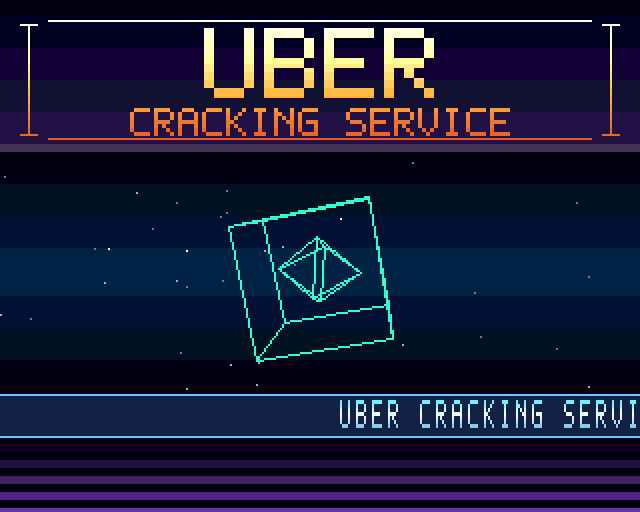

# UBER CRACKING SERVICE presents: NEON VECTORS

A small, source-complete **PAL Motorola 68000 cracktro** for classic Amiga OCS/ECS hardware,
written in assembly for [VASM](http://sun.hasenbraten.de/vasm/). It takes over the machine and
shows a gradient logo, a **3D starfield**, a rotating **3D wireframe** (cube and octahedron drawn
by the blitter) and a text scroller over Copper colour bars, while a four-channel tracker tune
plays through Paula. A left click hands the system back cleanly.

Everything it shows and plays is generated by code in this repository — there are no binary
blobs to trust: a Python script builds the logo, the font and the `M.K.` module deterministically,
byte for byte.



*The image is rendered by this project's test harness from the program's own Copper list and
bitplane memory while it runs on an emulated 68000. It is not a capture from a real Amiga — see
[What has and has not been verified](#what-has-and-has-not-been-verified).*

## Contents

- [Features](#features)
- [Requirements](#requirements)
- [Build](#build)
- [Run it](#run-it)
- [Testing](#testing)
- [What has and has not been verified](#what-has-and-has-not-been-verified)
- [How it works](#how-it-works)
- [Repository layout](#repository-layout)
- [Customising](#customising)
- [Known limitations](#known-limitations)
- [Documentation](#documentation)

## Features

- PAL 320×256 low resolution, 3 bitplanes / 8 colours, Copper-driven display
- **Copper gradients**: the logo text and its background shade from white through gold to orange
  every two lines; the scroller strip has its own gradient and frame lines; colour bars form a
  floor below; one animated bar pulses under the logo
- Two-line **`UBER` / `CRACKING SERVICE` logo**, generated from an embedded font
- **3D starfield**: 64 stars flying out of the screen with perspective projection, in three depth
  brightnesses (far, mid, near) made from the free bitplane combinations
- **3D wireframe**: a cube and a counter-rotating octahedron (24 edges), rotated with 7-bit fixed
  point matrices, perspective-projected, and drawn with the **blitter in line mode** into a
  **double-buffered** bitplane, so a half-drawn frame is never shown
- MSB-first planar text scroller, double height, shifted with a longword `ROXL` chain
- Real 31-instrument `M.K.` MOD, all four Paula channels, reliable DMA retrigger and silent
  termination for one-shot samples
- System takeover with `Forbid()`/`Disable()`, blitter ownership, `LoadView(NULL)`, and a complete
  restore on exit (View, system Copper list, DMA, interrupts, ADKCON, memory)
- Every DMA-visible payload is allocated in **chip RAM at run time**, verified with `TypeOfMem`,
  copied in one go and re-based through a relocation table, so it works whether or not the loader
  honours the hunk's chip-memory flag
- Left mouse button exits; return code 0 on success, 20 if it could not start

## Requirements

| Needed for | Tool |
| --- | --- |
| Build | GNU Make, Python 3.8+, [`vasmm68k_mot`](http://sun.hasenbraten.de/vasm/) |
| Emulated run test (optional) | `pip install machine68k` |
| Running | An emulator (FS-UAE, WinUAE, Amiberry) or a real PAL OCS/ECS Amiga, 512 KiB chip RAM, Kickstart 1.3 or later (or the AROS replacement ROM) |

No Pillow, host fonts or other Python packages are needed to build.

If `vasmm68k_mot` is not installed, `make toolchain` downloads the VASM source and builds just the
68k/Motorola-syntax assembler into `tools/bin/`:

```sh
make toolchain
```

For an offline build, unpack a reviewed VASM source tree and run
`VASM_SRC=/path/to/vasm make toolchain`. If HTTPS is blocked on your network you can point
`VASM_URL` at another mirror; the tarball is unsigned, so treat a plain-HTTP fetch accordingly.

## Build

```sh
make            # assets (only if the generator changed) -> validation -> assemble -> hunk check
```

The executable is `build/neon_vectors` (about 57 KiB). VASM is invoked with
`-m68000 -kick1hunks -Fhunkexe`, which writes a directly loadable Amiga Hunk executable with no
separate link step. Other targets:

| Target | What it does |
| --- | --- |
| `make assets` | Regenerate `logo.raw`, `font.raw`, `neon.mod`, `logo_preview.png` |
| `make validate` | Asset checks and static source checks (runs automatically before assembly) |
| `make verify-repro` | Generate the assets twice and require identical SHA-256 hashes |
| `make mutants` | Self-test of the validator: inject 33 faults, require each to be reported |
| `make emutest` | Run the assembled program on an emulated 68000 and check its behaviour |
| `make emu-mutants` | Self-test of the emulation test: inject 14 faults, require each to fail it (slow) |
| `make release` | `clean`, build, reproducibility check, regenerate `MANIFEST.sha256` |
| `make clean` / `make distclean` | Remove `build/` / also remove the generated assets |

## Run it

Copy `build/neon_vectors` into a folder your emulated (or real) Amiga can see — a hard-file, a
mounted directory or an ADF — and start it **from a Shell/CLI**:

```
1> neon_vectors
```

Recommended emulator configuration: A500 (OCS/ECS chipset is enough), **PAL**, 68000, at least
512 KiB chip RAM, Kickstart 1.3 or later or the AROS replacement ROM. Press the **left mouse
button** to exit.

FS-UAE example (`neon.fs-uae`; supply your own ROM paths — the free AROS ROM pair `aros-rom.bin` /
`aros-ext.bin` ships in Amiberry's `roms/` directory):

```ini
[fs-uae]
amiga_model = A500
chip_memory = 1024
slow_memory = 512
kickstart_file = /path/to/aros-rom.bin
kickstart_ext_file = /path/to/aros-ext.bin
hard_drive_0 = /path/to/folder-containing-neon_vectors
```

Create `S/Startup-Sequence` in that folder containing the single line `neon_vectors`.

## Testing

Four independent layers, from cheap and static to behavioural:

```sh
make validate      # static: assets + 68000 source rules
make mutants       # the validator must catch 33/33 injected faults
make emutest       # dynamic: run the real binary on an emulated 68000
make emu-mutants   # the emulation test must catch 14/14 injected faults
```

**`make validate`** (`tools/validate.py`) checks the generated assets (MOD structure, sample
levels, logo geometry, unsupported tracker effects) and the source (symbol cross-reference, Copper
list structure, relocation discipline, call-register conventions and the `a6` library base,
indexed-displacement range, PC-relative misuse, illegal immediates, read-only-register writes,
DMACON/LVO constants).

**`make emutest`** (`tools/emu_test.py`) assembles a symbol-carrying copy and runs it on the
Musashi 68000 core with stubbed Exec/graphics.library and a model of the parts of the custom chips
it touches — including a **blitter model** (line mode and rectangle clear) and a Copper
interpreter. It verifies, among other things:

- the library calls use the real register conventions (base in `a6`) and the program leaves no
  memory, no library and no `Forbid`/`Disable` nesting behind, and preserves every register
- DMACON/INTENA/ADKCON are restored, audio DMA is left off, and `WaitTOF` is never called with the
  vertical-blank interrupt masked
- the loop advances exactly once per frame, within about 55 % of a frame's CPU budget, and the
  single-buffered parts (stars, scroller) finish before the beam reaches them
- the wireframe buffers alternate every frame
- every Paula channel start and loop/terminal reload matches the module data
- the rendered frame is **pixel-exact** against independent Python reference models: logo, every
  star position and depth class, the scroller band, and the wireframe (reference rotation,
  perspective and Bresenham) — the wireframe on **every** frame
- the failure paths: chip allocation failure (`--alloc-fast`), a loader that honours the chip flag
  (`--loader-chip`), and a 262-line NTSC frame (`--ntsc`) where the PAL-only intro must not hang

The harness itself was mutation-tested (`make emu-mutants`): re-injecting swapped octant-table
entries, `ONEDOT`, a missing buffer swap, a short band clear, a wrong matrix sign, missing star
erase, a scroller overrun, blitter DMA off, a missing Copper wrap, an off-by-one `AUDxLEN`, swapped
`CopyMem` arguments, missing frame-sync edge detection, leaked memory and a masked interrupt before
`WaitTOF` each makes it fail.

## What has and has not been verified

**Done in this repository:** the source assembles cleanly with VASM 2.0f; the output is a valid
Hunk executable (`tools/hunkcheck.py`); the static checks, both mutation self-tests and the
emulated-68000 test all pass; and the program was **run in FS-UAE** (cycle-exact, emulated PAL A500)
with the free AROS Kickstart replacement: the gradient logo, starfield, rotating wireframe and
scroller appear, a left click exits, and the Shell prompt returns. Running on the emulated
hardware found bugs that the stub-based test could not (see [`docs/AUDIT.md`](docs/AUDIT.md)) and
confirmed that the blitter line setup is right on real (emulated) blitter behaviour.

**Not done:** it has **not** been run with a genuine Commodore Kickstart ROM or on real hardware,
and audio was not judged by ear. The emulated-CPU test does not model DMA cycle stealing,
blitter *timing*, sprites or Kickstart itself, so its timing figures are optimistic. Run it on a
PAL OCS/ECS machine before calling a release final; the checklist is in
[`docs/BUILD_AND_TEST.md`](docs/BUILD_AND_TEST.md).

## How it works

1. **Capture** — opens `graphics.library` with `OpenLibrary`, saves the active View and the system
   Copper list (`GfxBase->copinit`). Library calls pass the library base in `a6`, as on every Amiga.
2. **Allocate** — `AllocMem(MEMF_CHIP)` for the whole payload block (Copper list, four screen
   buffers, logo, font, silence word, module), confirms it with `TypeOfMem`, `CopyMem`s the
   assembled block in and rewrites a table of eight pointers so code only ever uses runtime addresses.
3. **Take over** — `LoadView(NULL)`, two `WaitTOF`, own the blitter, snapshot DMA/interrupt/ADKCON
   state, `Forbid()` then `Disable()`, stop all DMA and interrupts.
4. **Run** — one iteration per PAL frame, synchronised to the first line below the display window:
   show the finished wireframe buffer, tracker tick (50 Hz), raster colour, stars, scroller, then
   draw the next wireframe into the hidden buffer with the blitter.
5. **Restore** — wait for the blitter, stop audio, drop all DMA, `LoadView(old)`, restart the system
   Copper list, restore ADKCON/INTENA/DMACON, `Enable()` then `Permit()`, `WaitTOF`, release the
   blitter, free the chip block, close the library, return.

**CPU budget.** About 71 000 cycles per frame on average and 80 000 worst case on the emulated
CPU (a frame is about 142 000), measured without DMA contention. The starfield and scroller are
single-buffered, so they must finish before the beam reaches them; the test measures this margin
(about 18 000 cycles for the stars in the worst frame). The wireframe is double-buffered precisely
because it takes most of a frame.

More detail: [`docs/ARCHITECTURE.md`](docs/ARCHITECTURE.md), [`docs/GFX.md`](docs/GFX.md),
[`docs/MUSIC.md`](docs/MUSIC.md).

## Repository layout

```
src/
  main.s            startup/restore, Copper list, stars, wireframe, scroller, payload data
  modplayer.s       bounded ProTracker replay core (notes, Cxx, F01..F1F)
  hardware.i        custom-chip offsets and Exec/graphics.library vectors, with register conventions
assets/             generated and checked in: logo.raw, font.raw, neon.mod, logo_preview.png
tools/
  generate_assets.py  deterministic logo/font/MOD/PNG generator (no external dependencies)
  gen_tables.py       prints the Copper gradient, sine and reciprocal tables pasted into main.s
  validate.py         static asset + source validator (gates the build)
  mutate.py           mutation self-test of the validator
  emu_test.py         behavioural test on an emulated 68000 (blitter + Copper model, reference renderers)
  mutate_emu.py       mutation self-test of the emulation test
  hunkcheck.py        structural parser for the emitted Hunk executable
  verify_repro.py     byte-for-byte asset reproducibility test
  make_manifest.py    writes MANIFEST.sha256
  bootstrap_vasm.sh   builds VASM from source into tools/bin
docs/               architecture, graphics, music, validation, build/test matrix, audit
MANIFEST.sha256     SHA-256 of every shipped file
```

## Customising

- **Scroll text** — edit `scroll_text` in `src/main.s` (printable ASCII 32–126, terminated by 0).
- **Logo** — change the two `centred(...)` lines in `tools/generate_assets.py`; the validator
  requires the ink to stay inside the 320-pixel screen and the 64-line band. Then `make`.
- **Colours and gradients** — edit the ramps in `tools/gen_tables.py`, run
  `python3 tools/gen_tables.py copper` and paste the result over the gradient section of the
  Copper list in `src/main.s`.
- **Wireframe** — the vertices and edges are the `verts` and `edges` tables in `src/main.s`; keep the
  object inside its 120-line band (there is no clipping — `make emutest` fails if it leaves it).
  The projection constants are `WIRE_D` and `WIRE_ZOFF`; if you change them, regenerate the
  `recip_wire` table with `tools/gen_tables.py`.
- **Starfield** — `NSTARS`, `ZSPEED`, `PROJ_F` and the depth thresholds are constants at the top of
  `src/main.s`; regenerate `recip_star` if `PROJ_F` changes.
- **Music** — `generate_assets.py` builds the module. The replay core supports notes/instruments,
  `Cxx` and `F01..F1F`; the validator rejects any other effect instead of mis-playing it.

After a change run `make && make emutest`; run `make release` to refresh the manifest.

## Known limitations

- **PAL only.** It is timed for a 50 Hz PAL frame. On NTSC it will not hang (the frame sync ends
  when the beam wraps) but it will be badly timed and should not be used there.
- **Start it from a Shell.** Workbench start-up messages are not handled or replied to.
- **The system is frozen** (`Forbid`/`Disable`) until you click; nothing else runs.
- **Paula audio is left off on exit**, deliberately: the previous audio-DMA state cannot be restored
  against changed channel registers.
- **The wireframe is not clipped.** It is sized to stay inside its band; change it carefully.
- **Not a general ProTracker player.** Only the effects the bundled tune uses are implemented.
- **Not hardware-tested** — see above.
- No licence file is included yet; until one is added, all rights are reserved by the author.

## Documentation

| File | Contents |
| --- | --- |
| [`docs/AUDIT.md`](docs/AUDIT.md) | The code audit: every defect found and how it was fixed |
| [`docs/ARCHITECTURE.md`](docs/ARCHITECTURE.md) | Startup/restore order, chip memory, Copper list, frame pipeline, CPU budget |
| [`docs/GFX.md`](docs/GFX.md) | Screen layout, colour scheme, starfield, wireframe, blitter line mode, scroller |
| [`docs/MUSIC.md`](docs/MUSIC.md) | The module, the replay core and the Paula retrigger sequence |
| [`docs/VALIDATION.md`](docs/VALIDATION.md) | What each check enforces and why |
| [`docs/BUILD_AND_TEST.md`](docs/BUILD_AND_TEST.md) | Build, test matrix and the emulator/hardware acceptance checklist |
| [`RELEASE_NOTES.md`](RELEASE_NOTES.md) | Change history |
